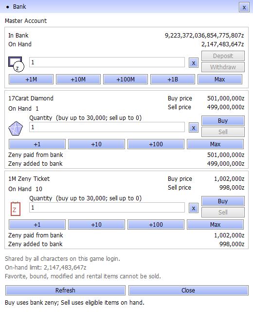

# PN Ragnarok

**Renewal progression. Shared account banking. Connected quest navigation.**

A customized [rAthena](https://github.com/rathena/rathena) server with fourth-job and Druid integration, expanded equipment services, and coordinated Windows client updates. This repository contains server source, custom content, client companion sources, and validation tools.

**[Download the latest client](https://github.com/patnawa/rathena_pn/releases/latest)** · [Release notes](doc/releases/client-2026-09-13.md) · [Player services](#player-services) · [Server setup](#server-setup) · [Documentation](#documentation)

| Current release | Baseline |
| --- | --- |
| Windows client | **13 September 2026 — Master Account & Quest Navigation** |
| Game rules | Customized Renewal with fourth jobs and Druid → Karnos → Alitea |
| Client/server packets | `20260219` |
| Account bank | Companion protocol v2; signed 64-bit bank balance |
| Connection | PN LAN server at `192.168.10.18` |
| Server stack | Login, character, map and web processes; Docker build tooling |

## Play

1. Open the [latest release](https://github.com/patnawa/rathena_pn/releases/latest) and download **all client `.part*.rar` files** from that release.
2. Keep every part in one folder. Extract **part 1 once** with a RAR5-compatible extractor; it reads the remaining parts automatically.
3. Download **`PN-Bank-v2.2-ItemFix-20260913.zip`** from the same release. With the game closed, copy its `BankUI.dll` and merge its `SystemEN` folder into the extracted `PN-Client` folder, replacing the two matching files. This includes the previous v2.2 fixes and the ticket item definition.
4. Run **`Check Client.cmd`**, adjust display settings with **`Setup.exe`**, then run **`Start Game.cmd`**. The bank title bar should show **v2.2**.

The client uses the LAN address above. You need access to that network to log in. When upgrading, close the game, extract into a fresh folder, and update desktop shortcuts to that folder. Keep the supplied `DATA.INI` order and bank/font DLLs together.

Releases include `INSTALL.txt`, `SHA256SUMS.txt`, and a `client-manifest.json` containing the size and SHA-256 of every extracted file. Full executables and GRFs are delivered through Releases; their companion sources and patch tools are in Git.

## Master Account bank

One bank balance is shared by **all characters on the same game login**. Open it through the game bank button, an NPC offering banking, **`@bank`**, **Alt+B**, or **Ctrl+B** after entering the game.

<p align="center">
  
</p>

*Native Windows panel preview with sample balances and inventory; not a captured gameplay session.*

| Balance | Capacity |
| --- | ---: |
| Shared account bank | **9,223,372,036,854,775,807 zeny** |
| Character wallet | **2,147,483,647 zeny** |

Deposit wallet zeny to fund purchases. Both exchange rows start at **one item**, show the current maximum buy/sell quantities, and display the bank cost or proceeds before you click.

**Bank v2.2** fixes periodic refreshes that briefly disabled Buy/Sell and caused blinking. Valid buttons stay enabled during balance checks, clicks are submitted once after fresh validation, and unchanged replies do not repaint the panel. Disabled exchanges retain their visible requirement messages. The latest **v2.2 ItemFix** patch also adds the missing **1M Zeny Ticket** definition so purchased tickets display their name, description and existing ticket artwork instead of **Unknown Item**. Get it from the [client release](https://github.com/patnawa/rathena_pn/releases/tag/client-2026-09-13-bank64). See the [refresh verification](doc/bank_refresh_20260913.md) and [ticket repair](doc/bank_ticket_20260913.md).

The server now queues the **new bank only** during connection and reconnection, suppressing the old bank's open/balance replies. This server update works with the existing v2.2 client. [Opening repair and validation](doc/bank_native_only_20260913.md).

| Item | Buy one | Sell one |
| --- | ---: | ---: |
| 17Carat Diamond — item `6024` | 501,000,000z | 499,000,000z |
| 1M Zeny Ticket — item `12781` | 1,002,000z | 998,000z |

The ticket quantity counts **inventory items**. Buy requires bank funds and inventory capacity; Sell requires eligible items on hand and room in the bank balance. Favorite, bound, rental, equipped and modified items are excluded from sale. Zero or invalid quantities disable the controls.

Transactions use server-checked integer arithmetic and a coordinated SQL commit for wallet, inventory, bank registry and journal. The 64-bit update preserves balances through character changes and normal saves. See the [bank guide](client-patch/account_bank/README.md), [transaction verification](doc/account_bank_64bit_20260913.md), and [Buy/Sell repair](doc/bank_controls_20260913.md).

<details>
<summary>Preview at maximum bank and wallet balances</summary>

<p align="center">
  
</p>

Sample values rendered by the same native panel. Deposits, withdrawals and item sales are unavailable when their destination balance is full; valid purchases remain available.

</details>

## Multi-storage

Open **`@storage`**, **`@mstorage`**, **Mystic Box in Prontera (158, 185)**, or **Main Office Kafra → Open multi-storage**. Rename personal pages and reorder the menu to suit your inventory.

| Storage | Initially available | Sharing |
| --- | --- | --- |
| Storage I–X | I–III | All characters on the same game login |
| Master Storage I–VI | I | All characters on the same game login |
| Card Storage | Yes; cards only | All characters on the same game login |
| Character Bound Storage | Yes; character-bound items only | Current character |
| Guild Storage | Native guild access rules | Authorized guild members |

Each additional regular or Master page costs **50,000,000 character-held zeny** and unlocks **600 slots** permanently for that game login. Choose **Expand Storages**, the first menu option, or select any **red locked page** to see its purchase confirmation. Cancelling costs nothing. Existing items remain in Storage I; names and menu order persist across character changes.

Personal item transfers save their source and destination together. Expansion payment and ownership also commit together, with replay protection and retries after failed saves. The menu uses the existing game client. See the [storage guide and validation](doc/multi_storage_20260913.md).

Card Storage enforces the server's **Card** item type for inventory and cart deposits, including GM accounts. The focused audit rejected **48 non-card deposits** and accepted **12 card deposits**, covering equipment with inserted cards, consumables, materials, card albums and six-digit card IDs. [Card-only evidence](doc/evidence/card_storage_only_20260913.json).

## World and progression

- **Quest navigation:** audited across all 16 loaded episode groups, **13.1 through 21**, with metadata for all **1,849 referenced episode quest IDs**. Repairs include long routes, map boundaries, 71 doorway/stair links, 48 elevator links, and 79 Episode 21 quest-book guides.
- **Classes and combat:** Renewal and fourth jobs, plus Druid → Karnos → Alitea skills, transformations, equipment eligibility and progression services.
- **Equipment:** native grading and supported enchant windows, Grade Workshop services, Druid gear and shadow enchants, and inventory-preserving upgrade fixes.
- **World services:** Main Office, Varmundt Biosphere and Depth 2 access, Zero Cell definitions, reputation initialization, and targeted episode reentry and reward repairs.
- **Client experience:** English Setup and interface repairs, Rune resources, launcher preflight, and coordinated item, map and navigation patches.
- **Connection recovery:** server links resolve Docker hostnames again during reconnect, correcting stale-address login failures.

The [navigation audit](doc/quest_navigation_audit_20260913.md) documents route and metadata coverage. Quest, level, party and instance access conditions still apply. Feature reports distinguish automated checks from manual gameplay coverage.

## Player services

| Service | Open or visit | Purpose |
| --- | --- | --- |
| Main Office | `@office` · `pn_office,100,40` | Searchable directory across 52 lobby, training and fashion desks |
| Progression Guide | Main Office · `pn_office,108,80` | Next story objective, Chapter 2 stages, daily availability, equipment services and material sources |
| Account bank | `@bank` · Alt+B · Ctrl+B | Shared savings, wallet transfers, diamond and ticket exchanges |
| Multi-storage | `@storage` · `@mstorage` · Prontera Mystic Box · Office Kafra | Account pages, card storage, private bound items and 50M expansions |
| Saved settings | `@settings` | Character overrides and game-account login preferences |
| Loot presets | `@alc save 1 Farming` · `@als 1` | Ten named game-account autoloot sets |
| Kill counter | `@kc 1002 1` · `@kc status` | Five persistent character tracking slots |
| Grade Enhancer | Office training floor · `grademk,34,184` | Native grading and Etel exchange |
| Rune Tablet | Office training floor · `grademk,46,178` | Account collection and character tablet enhancement |
| Battle statistics | `@bs` · `@bs2` | Offensive and defensive snapshots |
| PN Services | `izlude,140,146` · `grademk,46,180` | Damage lab, access diagnostics and navigation |
| Skill Supplies | `izlude,137,150` · `grademk,42,180` | Skill consumables |
| Reset Girl | `prontera,150,193` | Skill and stat resets |
| Card Remover | `prt_in,28,73` | Card removal; costs and risks are stated in the NPC dialogue |
| Druid Mentor | `prontera,153,193` | Druid, Karnos and Alitea progression |

Use `@commands` and `@help <command>` for in-game discovery. See the [command guide](doc/player_commands_reference_audit_20260908.md), [Main Office guide](doc/main_office.md), and [battle-stat reference](doc/pn_battlestats.md). The damage lab uses an intentional Poring training dummy; its [measurement guide](doc/quality_services.md) explains the results and limits.

## Server setup

Start with the [Docker guide](tools/docker/README.md), [configuration reference](conf/readme.md), and [database notes](sql-files/README.md). Prepare a separate development database, supply local credentials and advertised addresses, and select the packet version before compiling.

From a development checkout in Bash or WSL:

```sh
docker build -t rathena-pn-build:local tools/docker
docker run --rm --network none \
  -v "$PWD:/rathena" \
  -e BUILDER_CONFIGURE=--enable-packetver=20260219 \
  -e BUILDER_FORCE_BUILD=1 -e BUILD_JOBS=2 \
  rathena-pn-build:local sh tools/docker/builder.sh
```

This compiles all four server binaries into the mounted checkout. The Docker guide includes PowerShell examples, Compose startup and database initialization. The [PN build workflow](.github/workflows/build_servers_docker.yml) retains binaries and checksums as CI artifacts.

Deploy matching server binaries and client resources together. Follow the [bank installation guide](client-patch/account_bank/README.md) for migrations and companion files. Retain database backups and matching prior binaries; review upgrade SQL individually. Once bank balances exceed the old limit, restoring a 32-bit bank binary would truncate them.

| Path | Contents |
| --- | --- |
| [src/](src/) | Engine, networking, combat and scripting |
| [db/import/](db/import/) · [npc/custom/](npc/custom/) | PN definitions, NPCs and progression |
| [conf/](conf/) · [sql-files/](sql-files/) | Configuration, schemas and migrations |
| [client-patch/](client-patch/) | Companion sources, patches and installers |
| [tools/docker/](tools/docker/) · [tools/ci/](tools/ci/) | Builds, audits and regression tools |
| [doc/](doc/) | Guides, investigation reports and deployment evidence |

## Validation

The current bank baseline includes **500,000 randomized arithmetic cases**, **49 SQL checks**, **14 isolated login/character/map scenarios**, and **38 release checks**. The Buy/Sell repair adds real Windows control clicks with a recording transport, alongside shipping DLL-loader, font, transport and rendering checks.

Multi-storage passed **185 SQL assertions** and now **17 authenticated storage scenarios**, including the visible Mystic Box, player/GM commands, purchase cancellation, exact expansion fees, shared/private pages, a full 600-slot page and map crashes. The initial storage build also passed the bank scenarios and all 38 release checks. See the [original deployment evidence](doc/evidence/multi_storage_20260913.json) and [storage dialog verification](doc/evidence/storage_dialog_20260913.json).

Navigation verification combines native route distances with client collision data across the loaded episode groups. Distribution checks test the multipart archive, compare every extracted file to its SHA-256 manifest, and run launcher preflight on the extracted client.

Run relevant checks from the repository root:

```sh
python3 tools/ci/bank_core_test.py
python3 tools/ci/bank_service_test.py
```

```powershell
powershell -NoProfile -File tools/audit_episode_integrity.ps1 -StrictContent
```

Native tests need the documented compiler/runtime dependencies. Dated reports record tested scenarios and limitations; they are not live health indicators or a manual playthrough of every quest and client interaction.

## Documentation

| Topic | Guides and evidence |
| --- | --- |
| Latest audit | [Six-area audit and deployed fixes](doc/audit_all_20260914.md) · [Rendered checklist](doc/rendered_acceptance_20260914.md) |
| Current client | [Release notes](doc/releases/client-2026-09-13.md) · [Bank controls](doc/bank_controls_20260913.md) |
| Banking | [Compact v2.3 panel](doc/bank_compact_20260914.md) · [Build/install](client-patch/account_bank/README.md) · [64-bit persistence](doc/account_bank_64bit_20260913.md) |
| Storage | [Pages, expansion, migration and validation](doc/multi_storage_20260913.md) |
| Navigation | [Episode route audit](doc/quest_navigation_audit_20260913.md) · [Episode status](doc/episode_audit_status.md) |
| Login | [Docker reconnect fix](doc/login_outage_20260913.md) · [Binary compatibility](doc/login_character_abi_repair_20260907.md) |
| Druid | [Integration](doc/druid_integration.md) · [Client progression](doc/druid_client_progression.md) · [Gear and enchants](doc/druid_gear_enchants_audit.md) |
| Equipment | [Grademk](doc/grademk_equipment_service_audit.md) · [Refinement](doc/refine_system_audit_20260908.md) · [Grading](doc/grade_system_audit_20260908.md) |
| Rune Tablet | [Transactions](doc/rune_tablet_transactions.md) · [Bonuses](doc/pn_rune_tablet_bonus_notes.md) |
| Client patches | [Chapter 2](client-patch/chapter2_native/README.md) · [Biosphere](client-patch/biosphere/README.md) · [Zero Cell](client-patch/zero_cell/README.md) |
| Development | [Native script tests](tools/ci/native_script_vm_README.md) · [Script commands](doc/script_commands.txt) · [Item bonuses](doc/item_bonus.txt) |

## Contributing and license

Keep changes scoped and include affected server definitions, client requirements, validation results and deployment notes. Follow the [contribution guidelines](.github/CONTRIBUTING.md). Report defects with the release version and relevant logs, excluding account credentials and personal data.

Based on rAthena, with credit to the **rAthena Development Team**, **eAthena**, and their contributors. Existing copyright and attribution notices are retained.

Server source is distributed under the [GNU General Public License v3.0](LICENSE); third-party components retain their respective licenses. This license does not grant rights to Ragnarok Online client assets or third-party GRFs. See the [source signature guide](doc/script_licensing.md) and [client companion notices](client-patch/SOURCE-NOTICES.md).
