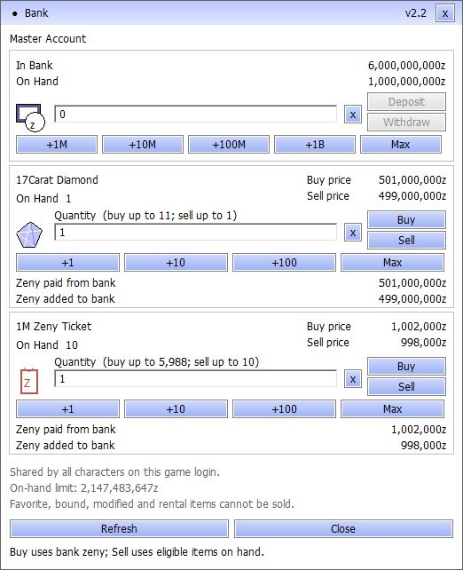

# Six-area audit — 14 September 2026

The follow-up reproduced and fixed a delayed-mail/bank money-loss defect and
added missing client metadata for eight active Chapter 2 drops. The server fix
was deployed at 06:17 UTC (13:17 Bangkok). The client fix is installed in the
local client and supplied as a cumulative ZIP. All 40 release checks passed.

Rendered acceptance is **partial**. The actual Ragexe client reached the QA
world and displayed the authenticated bank panel, but automated input did not
complete its transaction controls. No rendered transaction, full quest, or boss
playthrough is claimed.

## Coverage and results

| Area | New evidence | Result and boundary |
|---|---|---|
| Economy interactions | Three delayed-mail cases; five two-account transfer scenarios; all 15 existing bank scenarios | Passed on actual login/character/map processes and disposable MariaDB. Includes bank → storage → cart, item-for-zeny trade, vending, mail, duplicate requests, reconnects, SQL failures and process crashes. |
| Bank and storage UI | Actual QA login/world and bank screenshot; four native Windows control/transport/loader fixtures; 17 real storage protocol scenarios | Rendering and native fixtures passed. Automated Ragexe transaction/menu input remains unverified; the full rendered checklist stays open. |
| Quests and parties | Real two-account party creation, joining, leadership transfer, shared instance entry, leader disconnect and re-entry; full native script-VM gate | Passed within these cases. Gate includes Episode 21 finale/checkpoints, instance entry/warper, Chapter 1 protection, Bioresearch, Alice and other regressions. |
| Obtainable item coverage | Typed acquisition graph; active monster-drop definitions; actual Lua registration; GRF payload checks | Eight missing definitions fixed. The scoped graph now has no source-reachable item without metadata. Dynamic routes and actual artwork fallback behavior remain outside the proof. |
| Combat and equipment | Actual physical and Fire Bolt packets; neutral/water comparison; native element, card/combo, bonus, casting, Druid and instance-rule checks | Passed representative live combat and native regressions. This is not an exhaustive fight/equipment matrix. |
| Backup and recovery | Fresh production dump restored in an isolated database; separate populated-page recovery fixture | Passed: 137 production tables restored, with identical SQL digest. All 18 personal storage pages and synthetic 64-bit values/metadata round-tripped separately. No physical host-power-loss test. |

All player interactions and failure injection used disposable accounts and
databases. The production restore tests restored into new containers, never
over the live database. Existing uncommitted project improvements were retained.

## Reproduced money loss and repair

A RODEX claim reserves wallet capacity until the character server replies.
Previously a bank withdrawal could consume that capacity before the claim was
delivered. With the character server deliberately paused, a wallet at
2,147,483,547, bank balance 1,000 and mail attachment 100 lost exactly 100 zeny
after a competing withdrawal and the delayed reply.

| State | Before fix | After fix |
|---|---:|---:|
| Total wallet + bank + mail before | 2,147,484,647 | 2,147,484,647 |
| Total after delayed claim and withdrawal | 2,147,484,547 | 2,147,484,647 |
| Lost zeny | **100** | **0** |

The shared busy check now includes pending mail money, inventory slots and
weight. The bank also rejects mutations while the mail composer is open, and
the asynchronous premium-storage callback rechecks those reservations before
opening. The guard releases when the claim completes. It does not add mail
claims to the financial-commit logout lock.

The second regression preserves the last inventory slot during a pending mail
item claim. The third verifies that cancelling the composer permits an exact,
persisted bank deposit. Native tests also cover the three reservation types and
storage opening. The normal trade/vending/mail suite retained all 40 synthetic
potions across its complete transfer chain.

Evidence: [before](evidence/audit_all_20260914/mail-before.log),
[after](evidence/audit_all_20260914/mail-after.json),
[transfer chain](evidence/audit_all_20260914/economy-transfers.json),
[bank regression](evidence/audit_all_20260914/bank-regression.json).

## Missing Chapter 2 drops

| Item ID | Effective server label | Display weight |
|---|---|---:|
| 1002678 | Crispy Yongjirak Meat | 1 |
| 1002679 | Burning Leather | 1 |
| 1002681 | Old Snack | 1 |
| 1002683 | Fluffy Sparks | 1 |
| 1002693 | Frost Shards | 1 |
| 1002695 | Ice Jelly | 1 |
| 1002702 | Ghost Flower | 0 |
| 1002705 | Halppeong | 0 |

These IDs appear in effective Chapter 2 monster drop tables with active spawns
in `npc/custom/chapter2/Chapter2.txt`. The existing material import now provides
their names, Etc type and server-derived weights. An independently supplied
base translation is preserved. All eight use the project's existing generic
`EpisodClear20` material artwork. Its item BMP, collection BMP, SPR and ACT were
located using actual GRF precedence and decompressed successfully.

The real Lua 5.1 loader and `main()`/`AddItem` callbacks registered 26,916 items:
the previous 26,908 records plus these eight definitions. Tests reproduced the
original omissions, checked every unaffected record recursively, repeated the
load, and checked preservation of independent translations. The staged client
passed quick checks and all 5,625 file hashes; the installed loader passed again.

The acquisition graph traversed 920 active NPC files, 29,590 effective item
definitions and 2,999 item groups, finding typed source paths to 4,961 items.
The earlier 1,595 raw-art-reference candidates had no path in this limited graph.
That does **not** establish that they are unobtainable: 199 dynamic grant lines,
conditional spawns, barter and achievement routes remain outside its analysis.

Evidence: [acquisition summary](evidence/audit_all_20260914/item-acquisition.json),
[Lua registration](evidence/audit_all_20260914/chapter2-drop-lua.log),
[four assets](evidence/audit_all_20260914/chapter2-drop-art.json),
[client package](evidence/audit_all_20260914/client-update.json).

Cumulative local delivery:
`server-work/audit-all-20260914/client-update/PN-Client-Update-20260914-Audit.zip`

SHA-256: `a461d15553a05fda2236730e5e4859aa00746af4245b5474483309af4baf784a`

Apply after the 13 September full client release, with the game closed. This ZIP
includes the preceding 14 September client fixes. It has not been published to
GitHub Releases. Local replaced files and their hashes are retained under the
package's `installed-backup` directory.

## Runtime and recovery evidence

The storage run repeated all 17 protocol scenarios, including 600-slot loading,
page expansion/cancellation, page names/order, sibling and character ownership,
guild permissions, cart transfers, database failures and actual map crashes.
The card run rejected 48 non-card deposits and accepted 12 valid deposits across
inventory/cart and normal/GM accounts, including six-digit card IDs.

The recovery fixture populated all 18 configured personal pages, page
entitlements/names, a bank value near signed 64-bit capacity, unsigned 64-bit
item identities, and refine/card/option/grade/binding fields. Its 97-table SQL
dump was identical after restoration. These deliberately extreme SQL records
test preservation, not whether every synthetic equipment combination is legal.

Two fresh production backups were restored successfully. The deployment-time
backup covered 137 tables and had SQL SHA-256
`a350ba57e7b8d90f95cf13fe72a3a177a3cfd0fbdb7cbf8e4ee88ef259eb7cd8`.
The private SQL remains on the server; this repository contains receipts only.

Evidence: [storage/recovery](evidence/audit_all_20260914/storage-recovery.log),
[card filtering](evidence/audit_all_20260914/card-regression.json),
[party and combat](evidence/audit_all_20260914/party-combat.json),
[fresh backup](evidence/audit_all_20260914/deployment-backup.log).

## Release and deployment

The stable candidate passed all 40 release checks, including 312 YAML files,
native transaction/script regressions and isolated startup. Native finale and
checkpoint results include 46 and 113 assertions/checks respectively; the gate
also passed 815 instance-combat-rule checks in each of its two builds.

Additional native checks in this audit session passed 400 element cells/2,800
damage cases; the Liberation/Deviruchi bonus regressions; 48 sealed-performer
cases; the 5,719-card/enchant and 5,169-combo audit with 10,505 scripts; casting
and Druid integration tests. Four Windows fixtures passed using the existing
shipping bank implementation. These are separate from rendered Ragexe input.

Deployment verified the live files against the previous verified candidate,
required zero online characters, made a fresh checked backup, and replaced only
the map executable and its three changed source files. Startup and health
passed. The recorded player-data table snapshots were identical. Login,
character and web binaries and the database schema were unchanged. Previous
application files are retained for rollback; player SQL is never automatically
restored by the rollout script.

Deployed map SHA-256:
`455ab58bc569c708783f04eccc2adce78c863286f8ce8577e4933c845997c825`

Evidence: [build](evidence/audit_all_20260914/server-build.json),
[40-check report](evidence/audit_all_20260914/full-release.json),
[native result summary](evidence/audit_all_20260914/full-gate-summary.log),
[Windows fixtures](evidence/audit_all_20260914/windows-fixtures.json),
[rollout and health](evidence/audit_all_20260914/deployment.json).

## Rendered boundary and rerunning

The disposable client used the same Ragexe and bank DLLs, a private clientinfo
overlay within the client's ten-GRF limit, and SSH-only forwarding into a
separate QA realm. The user logged in and opened the bank. The captured panel
showed 6,000,000,000 bank zeny, 1,000,000,000 wallet zeny, correct exchange prices,
one-item defaults and capacity maxima. Automated clicks/shortcuts did not
produce a committed QA bank transaction, so they are not counted as passes.

The [final panel](evidence/audit_all_20260914/rendered-bank-final.jpg) and
[QA database receipt](evidence/audit_all_20260914/qa-final-state.json) confirm
the unchanged balances, one diamond, ten tickets and zero committed bank
transactions. The [local diagnostics](evidence/audit_all_20260914/rendered-bank-diagnostics.txt)
showed an authenticated, verified connection with enabled transaction controls.
The cause of the failed automated input was not established.

The two QA containers, loopback proxy and local SSH tunnel were stopped after
evidence capture. QA container data, logs and the isolated network were retained.
The [final server check](evidence/audit_all_20260914/final-check.json) passed
health checks and verified that the deployed executable/source hashes still
match the rollout receipt.

The [rendered checklist](rendered_acceptance_20260914.md) remains open for full
transaction/menu operation, relog/sibling UI, quest/boss playthroughs and item
art/navigation rendering.

New reusable clients are `economy_mail_overlap_live.py`,
`economy_transfers_live.py`, `party_combat_live.py`, and
`storage_recovery_live.py` under `tools/ci`. Run them through
`multi_storage_live_test.py` with `PN_STORAGE_CANDIDATE`,
`PN_STORAGE_TEST_ROOT` and `PN_STORAGE_LIVE_CLIENT` set to separate disposable
paths. For the economy and party clients, also select their matching file under
`tools/ci/fixtures` with `PN_STORAGE_EXTRA_NPC`. Their fixture labels and network
namespace guards must remain enabled; do not point them at production.

The client regression is `tools/ci/chapter2_drop_metadata_test.py --lua LUA51
--client CLIENT --require-installed`. The complete acquisition inputs and
one-off rollout/QA scripts are retained in `server-work/audit-all-20260914`.
