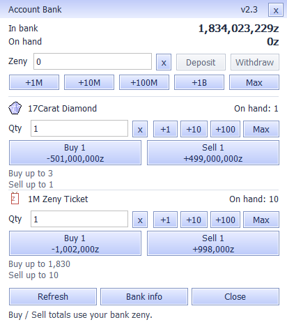

# Compact bank v2.3 — 14 September 2026

The bank now occupies **414 × 484 pixels**, down from 522 × 642: **40.21% less
screen area**. All six transaction actions remain visible. The updated DLL is
installed in the local client and included in a cumulative client update.

The image is a native rendering of the production panel with synthetic balances.
It is not a screenshot of a new Ragexe login or a production transaction.

## Layout and interaction

- Larger, right-aligned bank and wallet balances remain visible at the top.
- Zeny presets use one compact row. Item quantity, clear, presets and Max share
  one line for each exchange item.
- Buy and Sell buttons show the selected quantity and exact total, including
  fees. For example, buying two tickets shows **Buy 2 / −2,004,000z**; selling
  two shows **Sell 2 / +1,996,000z**. The sign describes the bank balance change.
- Each exchange retains its available quantities and specific rejection reasons,
  including the exact zeny shortfall. Invalid or overflowing quantities never
  display a wrapped monetary total.
- Bank info contains account-sharing details, wallet/bank limits and sale
  eligibility. The panel opens within the monitor's usable area.
- Existing bank entry points, keyboard navigation, refresh behavior, queued
  actions and transaction protections are preserved.

The body font retains its original size; the balance font is larger. Normal and
original 1.10 font renderings were inspected for maximum balances, largest
transaction totals, insufficient funds, invalid quantities and disconnection.
The smaller layout removes repeated price descriptions and permanent help text.

## Verification

All four rebuilt Windows suites passed:

| Suite | Relevant checks |
|---|---|
| BankUITest | All controls fit without overlaps; exact captions; largest valid totals fit native and 1.10-size fonts; invalid inputs; all six actions; duplicate/pending guards; changed funds/items/capacity; session changes |
| BankRefreshTest | Production panel and transport; real hooked authentication; delayed/fragmented loopback replies; one queued purchase; committed result; logout cancellation |
| BankTransportTest | Shipping socket hooks, authentication, persistent connection and protocol checks |
| BankLoaderTest | Existing FontScale forwarding, original 1.10 font extension, new BankUI loaded hidden with unauthenticated actions disabled |

The existing tests for unchanged refresh replies still pass without enable-state
changes or a panel repaint. Dynamic button captions are changed only when their
quantity or total changes. The transport and server transaction implementation
were not changed for this layout update.

Evidence: [native results](evidence/bank_compact_20260914/native-results.json),
[control log](evidence/bank_compact_20260914/bank-ui.log),
[refresh log](evidence/bank_compact_20260914/bank-refresh.log),
[maximum balance](evidence/bank_compact_20260914/max-scaled.png),
[large totals](evidence/bank_compact_20260914/large-total-scaled.png),
[insufficient funds](evidence/bank_compact_20260914/needs-deposit-scaled.png),
[invalid quantity](evidence/bank_compact_20260914/invalid-scaled.png),
[disconnection](evidence/bank_compact_20260914/disconnected-scaled.png).

## Installation and package

The update replaced `BankUI.dll`, `VERIFY-CLIENT.txt` and `client-manifest.json`
after confirming Ragexe was closed. Previous files and hashes are retained in
`server-work/bank-compact-20260914/client-update/installed-backup`. The original
game executable, font extension/settings, bank connection settings, archive
order and Chapter 2 metadata were verified unchanged.

The staged distribution passed startup checks and all **5,625** file hashes.
ZIP integrity and payload equality passed. The installed files matched their
package hashes and the installed startup check passed.

Package: `PN-Client-Update-20260914-Bank-v2.3.zip` (600,910 bytes).

SHA-256: `34e391cac808c0b67bf135438fea350036e346d6bc2188068a396b2c5c24e2a8`

BankUI.dll SHA-256:
`6e82edfde303e819c602b6ac6019c9f6e6a54edb3cecdd7c42f413a9fa21f510`

Close the game and extract over the full 13 September client. This cumulative
ZIP includes the earlier 14 September audit, metadata and resource fixes.
Run Check Client.cmd and Verify Client.cmd, then start the game normally.
The package remains a local delivery; it has not been uploaded to GitHub Releases.

Evidence: [package and installed-file receipt](evidence/bank_compact_20260914/client-update.json).
The [rendered gameplay checklist](rendered_acceptance_20260914.md) remains the
separate acceptance boundary for a full Ragexe playthrough.
