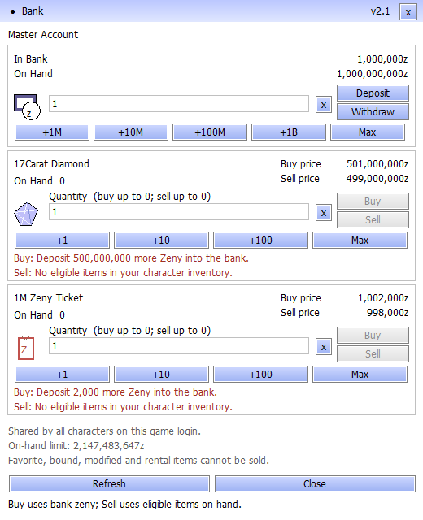

# Bank v2.1: clear Buy/Sell feedback

**Superseded by [Bank v2.2](bank_refresh_20260913.md)**, which also fixes periodic refresh disablement and panel flicker. Use the v2.2 patch for current installations; the following records the earlier feedback update.

Disabled Buy/Sell buttons now explain the requirement directly inside their item row. The panel shows the exact additional Zeny needed in the bank, missing eligible items, inventory space/weight limits, invalid quantities, balance limits, and connection or save status. Available exchanges continue to show their total cost or proceeds.

*Rendered by the production Windows panel with sample balances and inventory; this is not a player screenshot.*

## Buying and selling

Purchases use **In Bank**, while **On Hand** is the current character's separate wallet. Enter an amount in the top row and click **Deposit** to fund purchases. Item quantities start at one.

| Item | Buy from bank | Sell to bank |
| --- | ---: | ---: |
| 17Carat Diamond | 501,000,000 Zeny | 499,000,000 Zeny |
| 1M Zeny Ticket | 1,002,000 Zeny | 998,000 Zeny |

For example, a bank holding 1,000,000 Zeny needs **2,000 more Zeny deposited** to buy one ticket, or **500,000,000 more** to buy one diamond. Sell requires the corresponding eligible item in the current character's inventory. Favorite, bound, rental, equipped and modified items remain excluded.

## Install

Close the game, install the `PN-Bank-v2.1-20260913.zip` patch from the [client release](https://github.com/patnawa/rathena_pn/releases/tag/client-2026-09-13-bank64) into the folder containing `Ragexe.exe`, and start the game again. The bank title bar displays **v2.1**. This patch requires the existing PN Master Account client package and replaces `BankUI.dll`; its README includes the file checksum and backup instructions.

## Validation

The production Windows panel passed its native edit/button tests, including all four Buy/Sell actions, visible disabled-action reasons, a deposit followed by ticket purchase and sale, missing funds/items, invalid quantities, inventory and bank capacity, duplicate/pending requests, disconnected and stale sessions. The shipping DLL loader, original font extension and socket-hook transport tests also passed. Funded, unfunded and maximum-balance previews were rendered and visually checked.

The updated client was installed with backups and launcher validation. These are automated native-control and transport checks; player balances were not changed to test the interface. Prices, account sharing, server transaction rules, and the character wallet limit are unchanged. See the [verification record](evidence/bank_feedback_20260913.json).
