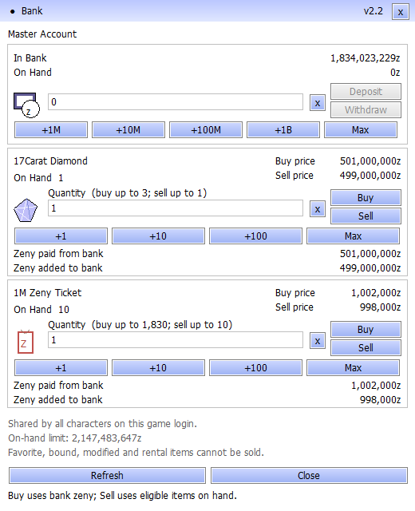

> **Bank v2.2 update:** After extracting the full client, install `PN-Bank-v2.2-20260913.zip` from the same release. It fixes periodic balance refreshes that disabled actions and caused blinking. Valid controls stay enabled; a click during refresh is revalidated and submitted once. Close the game before replacing `BankUI.dll`, then check for **v2.2** in the bank title bar. See the [repair and verification](../bank_refresh_20260913.md). This supersedes the v2.1 patch.

# PN Client — Master Account & Quest Navigation

**13 September 2026 · Full Windows client · Packet baseline `20260219`**

This release brings the Master Account bank, the Buy/Sell control repair, and the latest episode navigation resources together in a clean client download for the PN LAN server.



*Preview rendered by the native Windows panel with sample balances and items.*

## Highlights

### Master Account banking

- **One balance per game login**, shared by all its characters.
- Bank capacity of **9,223,372,036,854,775,807 zeny**. The character wallet keeps its **2,147,483,647 zeny** cap.
- Open through the game bank button, supported banker NPCs, `@bank`, **Alt+B**, or **Ctrl+B**.
- Corrected balance persistence through character changes and normal saves, including amounts above the previous 32-bit limit.
- Exact integer amounts throughout the client, server, registry and transaction journal.

### Buy/Sell controls repaired

The item quantity fields previously opened at zero, leaving Buy and Sell greyed out even when an exchange was otherwise possible. Both rows now start at **one item**, label the quantity, and show the maximum available to buy or sell.

**1M Zeny Ticket is an inventory item** (`12781`). Buying spends bank zeny and adds tickets to inventory; selling removes eligible tickets and credits the bank. Deposit wallet zeny first to fund purchases.

| Exchange item | Bank cost per item | Bank proceeds per item |
| --- | ---: | ---: |
| 17Carat Diamond (`6024`) | 501,000,000z | 499,000,000z |
| 1M Zeny Ticket (`12781`) | 1,002,000z | 998,000z |

The controls still enforce positive quantities, available funds/items, inventory capacity, bank capacity and pending transactions. Favorite, bound, rental, equipped and modified items are excluded from sale.

### Quest navigation and connection recovery

- Navigation and metadata coverage across **all 16 loaded episode groups, 13.1–21**, including all **1,849 referenced episode quest IDs**.
- Restored **71 physical doorway/stair links**, **48 elevator links**, and **79 Episode 21 quest-book guides**.
- Fixed long-route truncation, map-edge handling, blocked NPC approaches, and targeted Episode 20/21 room reentry defects.
- Matching server code resolves Docker hostnames again on reconnect, correcting the stale-address failure that prevented login after a container address changed.

The package also retains English Setup, English interface and Rune resources, Main Office assets, and the current equipment/enchant patches.

## Download and install

Get the files from [this release](https://github.com/patnawa/rathena_pn/releases/tag/client-2026-09-13-bank64).

**Download:** 4.26 GB across three volumes. **Extracted client:** 5.36 GB, containing 5,622 verified files.

| Asset | Purpose |
| --- | --- |
| `PN-Client-20260913-MasterAccount.part1.rar` | Start extraction here |
| `PN-Client-20260913-MasterAccount.part2.rar` | Required continuation volume |
| `PN-Client-20260913-MasterAccount.part3.rar` | Required continuation volume |
| `INSTALL.txt` | Installation, connection and banking instructions |
| `SHA256SUMS.txt` | SHA-256 checksums for the download assets |
| `client-manifest.json` | Size and SHA-256 for every extracted client file |

1. Download **all three RAR parts** into the same folder.
2. Close the game. Use a RAR5-compatible extractor to extract **part 1 once** into a fresh folder; the other volumes are read automatically.
3. Open `PN-Client`, run **`Check Client.cmd`**, adjust display settings in **`Setup.exe`**, then launch **`Start Game.cmd`**.

This build connects to **`192.168.10.18`** and requires access to the PN LAN. Update desktop shortcuts to the newly extracted folder. Preserve the supplied `DATA.INI` order and keep all bank/font companion files together.

To check a downloaded part in PowerShell, compare its result with `SHA256SUMS.txt`:

```powershell
Get-FileHash .\PN-Client-20260913-MasterAccount.part1.rar -Algorithm SHA256
```

## Verification

- **Client controls:** all four Buy/Sell buttons exercised through actual Windows controls with a recording transport. The regression fails against the old zero-quantity build and passes with this repair. Invalid inputs, duplicate/pending requests, capacity and session guards also pass.
- **Shipping Windows components:** DLL loading, original font scaling, authenticated loopback transport, and normal/maximum-balance native renders pass.
- **Bank/server baseline:** documented coverage includes 500,000 randomized arithmetic cases, 49 SQL checks, 14 isolated login/character/map scenarios, and 38 release checks. The arithmetic and production-handler sanitizer tests were rerun for the control repair.
- **Distribution:** multipart archive integrity tested; every extracted file compared to the SHA-256 manifest; launcher and archive preflight passed on the extracted client.

Navigation checks prove route geometry and metadata coverage; player quest and instance conditions still apply. Automated tests and native previews do not constitute a manual Ragexe playthrough of every interaction or quest.

## Technical references

- [Bank control diagnosis and repair](../bank_controls_20260913.md)
- [64-bit bank persistence and transaction verification](../account_bank_64bit_20260913.md)
- [Episode navigation audit](../quest_navigation_audit_20260913.md)
- [Docker login recovery](../login_outage_20260913.md)
- [Companion source and installation](../../client-patch/account_bank/README.md)

Personal saved settings, screenshots, replays, logs, backups and developer files are excluded from the distribution. AI friend IDs are reset. Original game assets retain their respective owners' rights; companion source and license notices are included.
